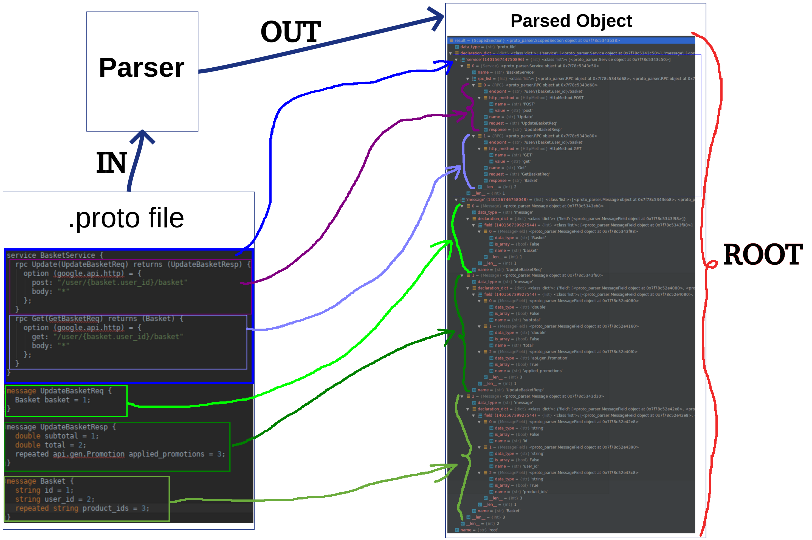

# Protobuf files parser

Allows you to parse protobuf files to python objects. This repo is part of base_assistant

## Getting Started

You only need to pass the filename as argument of the function.

```
parse_file("file_example.proto")
```


MIT License

